# MEGA ULTRA ROBOTER KI – Entwickler-Checkliste & Architektur

## 1. Architektur-Diagramm (PlantUML)

```plantuml
@startuml
!theme spacelab
actor "User (Mobile/Desktop)" as User
cloud "Cloudflare Tunnel" as Tunnel
rectangle "Windows Host" {
  [🤖ROBOTER_KI_APP.cs (.NET 8)]
  [Node.js Server (server.mjs):3000]
  [Python FastAPI:8000]
  [Streamlit Dashboard:8502]
  [Webhook Server:8503]
  [Ollama LLM:11434]
}
User --> Tunnel : HTTPS (extern, 4G/WLAN)
Tunnel --> [Node.js Server (server.mjs):3000] : HTTP (lokal, Port 3000)
[Node.js Server (server.mjs):3000] --> [Webhook Server:8503] : Proxy /api/stats, /api/paypal/*
[Node.js Server (server.mjs):3000] --> [Streamlit Dashboard:8502] : (optional, intern)
[Node.js Server (server.mjs):3000] --> [Python FastAPI:8000] : (optional, intern)
[🤖ROBOTER_KI_APP.cs (.NET 8)] --> [Node.js Server (server.mjs):3000] : Start/Überwachen
[🤖ROBOTER_KI_APP.cs (.NET 8)] --> [Python FastAPI:8000] : Start/Überwachen
[🤖ROBOTER_KI_APP.cs (.NET 8)] --> [Streamlit Dashboard:8502] : Start/Überwachen
[🤖ROBOTER_KI_APP.cs (.NET 8)] --> [Webhook Server:8503] : Start/Überwachen
[Python FastAPI:8000] --> [Ollama LLM:11434] : KI-Requests
@enduml
```



## 2. Entwickler-Checkliste

### Systemvoraussetzungen

- Windows 10/11, 8+ GB RAM (empfohlen: 16 GB, Redmi Note 13 Pro: RAM-Boost aktivieren)
- Node.js 20+ (empfohlen: LTS, `MEGA_NODE_EXE` setzen, falls nicht global)
- Python 3.14+ (venv empfohlen)
- .NET 8 SDK
- PowerShell 5.1+
- Cloudflare Tunnel (cloudflared)

### Python-Module

- Installieren via:  `pip install -r requirements.txt`
- Wichtige Pakete: fastapi, uvicorn, streamlit, requests, python-dotenv, openai, etc.

### Node.js-Setup

- Node.js muss im PATH oder via `MEGA_NODE_EXE` verfügbar sein.
- Start über:  `powershell -File scripts\start_node.ps1 -Port 3000 -BindHost 0.0.0.0`
- Prüfen:  `node --version` (sollte >= 20.x sein)

### PowerShell-Skripte

- `scripts\start_node.ps1` (Node robust starten)
- `scripts\stop_services.ps1` (Ports/Prozesse killen)
- `scripts\health_check.ps1` (Status aller Services prüfen)

### Mobile-Optimierung

- `public/mobile_dashboard.html` ist für Cordova/Capacitor/Android 15 vorbereitet.
- RAM-Optimierung:  Android: Entwickleroptionen → Hintergrundprozesse begrenzen
- Browser: Chrome/Edge Mobile, RAM-Saver aktivieren

### APK-Berechtigungen (Cordova/Capacitor)

- INTERNET
- ACCESS_NETWORK_STATE
- WAKE_LOCK (optional für Hintergrundbetrieb)
- WRITE_EXTERNAL_STORAGE (nur falls benötigt)

### Cloudflare Tunnel

- Installieren:  `cloudflared.exe` (<https://developers.cloudflare.com/cloudflare-one/connections/connect-apps/install-and-setup/>)
- Starten:  `cloudflared tunnel --url http://localhost:3000`
- Tunnel-URL im Handy-Browser öffnen

### Health-Check

- PowerShell:  `powershell -File scripts\health_check.ps1`
- Prüft Ports 11434, 3000, 8000, 8502, 8503 und HTTP-Status

### Debugging

- Logs:  Node: `logs/node.log`, Python: `logs/python.log`, .NET: `logs/dotnet.log`
- Bei Fehlern:  `scripts\stop_services.ps1 -Kill -Ports 3000,8000,8502,8503` und dann Services neu starten

## 3. Automatisierungs-Snippets

### Deployment (alle Services starten)

```powershell
powershell -File scripts\stop_services.ps1 -Kill -Ports 3000,8000,8502,8503
dotnet run --project 🤖ROBOTER_KI_APP.csproj
```

### Health-Check

```powershell
powershell -File scripts\health_check.ps1
```

### Cloudflare Tunnel

```powershell
cloudflared tunnel --url http://localhost:3000
```

### Node.js robust starten

```powershell
powershell -File scripts\start_node.ps1 -Port 3000 -BindHost 0.0.0.0
```

### Python-Backend starten

```powershell
$env:API_KEY="..." ; $env:APP_ID="..." ; $env:OPENAI_API_KEY="..."
uvicorn main:app --host 0.0.0.0 --port 8000
```

### Streamlit Dashboard

```powershell
python -m streamlit run dashboard_ui.py --server.port 8502
```

### Webhook-Server

```powershell
python webhook_server.py
```

---

# Diese Datei kann direkt von der KI oder jedem Entwickler eingelesen werden

# Speicherort-Vorschlag: /docs/MEGA_DEV_CHECKLIST.md oder im Projekt-Root
